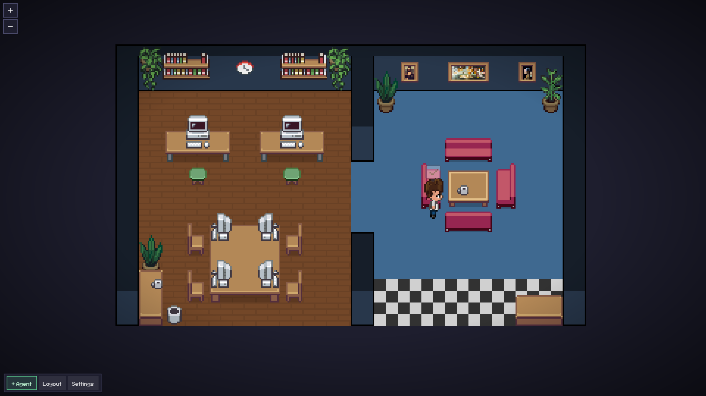

# 🦞 OpenClaw Pixel Agents

A pixel art office where your OpenClaw AI agents come to life as animated characters. Each agent session becomes a character that walks around, sits at their desk, and visually reflects what they're doing.

Forked from [pablodelucca/pixel-agents](https://github.com/pablodelucca/pixel-agents) and converted from a VS Code extension to a standalone web app for [OpenClaw](https://github.com/openclaw/openclaw).



## Features

- **One agent, one character** — every OpenClaw session gets its own animated character
- **Live activity tracking** — characters show what the agent is doing (reading, writing, searching, running commands)
- **Sub-agent visualization** — spawned sub-agents appear as separate characters with their task description
- **Office layout editor** — design your office with floors, walls, and furniture
- **25 furniture items** — desks, PCs (with on/off animation), chairs, sofas, plants, bookshelves, paintings, and more
- **6 diverse character sprites** — based on [JIK-A-4, Metro City](https://jik-a-4.itch.io/metrocity-free-topdown-character-pack)
- **Persistent layouts** — your office design is saved in localStorage
- **Sound notifications** — optional chime when an agent finishes

## Quick Start

```bash
git clone https://github.com/DevvGwardo/openclaw-pixel-agents.git
cd openclaw-pixel-agents
cp .env.example .env    # configure gateway URL + token
npm install
npm run dev
```

Then open http://localhost:5173/ in your browser.

### Configuration

Create a `.env` file (or copy `.env.example`):

```env
# OpenClaw Gateway URL (default port is 18789)
VITE_OPENCLAW_GATEWAY_URL=http://localhost:18789

# Gateway auth token (from ~/.openclaw/openclaw.json → gateway.auth.token)
VITE_OPENCLAW_GATEWAY_TOKEN=your_token_here

# Polling interval in milliseconds (default: 5000)
VITE_OPENCLAW_POLL_INTERVAL=5000
```

In development, the Vite dev server proxies API requests to the gateway (no CORS issues). The token is injected server-side and never exposed to the browser.

## How It Works

1. Polls the OpenClaw Gateway via `/tools/invoke` HTTP endpoint
2. Detects active sessions (main + sub-agents) via `sessions_list`
3. Monitors session history for tool calls and activity
4. Maps each session to an animated pixel character
5. Shows tool activity as labels above characters ("Reading file.ts", "Running: npm build", etc.)

## Usage

- **+ Agent** — shows connection status
- **Layout** — open the office editor to customize your space
- **Settings** — configure sound and other options
- Click a character to select it, click a seat to reassign

### Layout Editor

- **Floor** — paint floor tiles with color control
- **Walls** — auto-tiling walls with color customization
- **Furniture** — place desks, chairs, PCs, plants, and decorations
- **Undo/Redo** — 50 levels with Ctrl+Z / Ctrl+Y
- **Export/Import** — share layouts as JSON files

## Credits

- Original [Pixel Agents](https://github.com/pablodelucca/pixel-agents) by Pablo De Lucca
- Character sprites by [JIK-A-4, Metro City](https://jik-a-4.itch.io/metrocity-free-topdown-character-pack)
- Crab sprite reference by [Elthen](https://elthen.itch.io/2d-pixel-art-crab-sprites)
- Built for [OpenClaw](https://github.com/openclaw/openclaw)

## License

[MIT](LICENSE)
